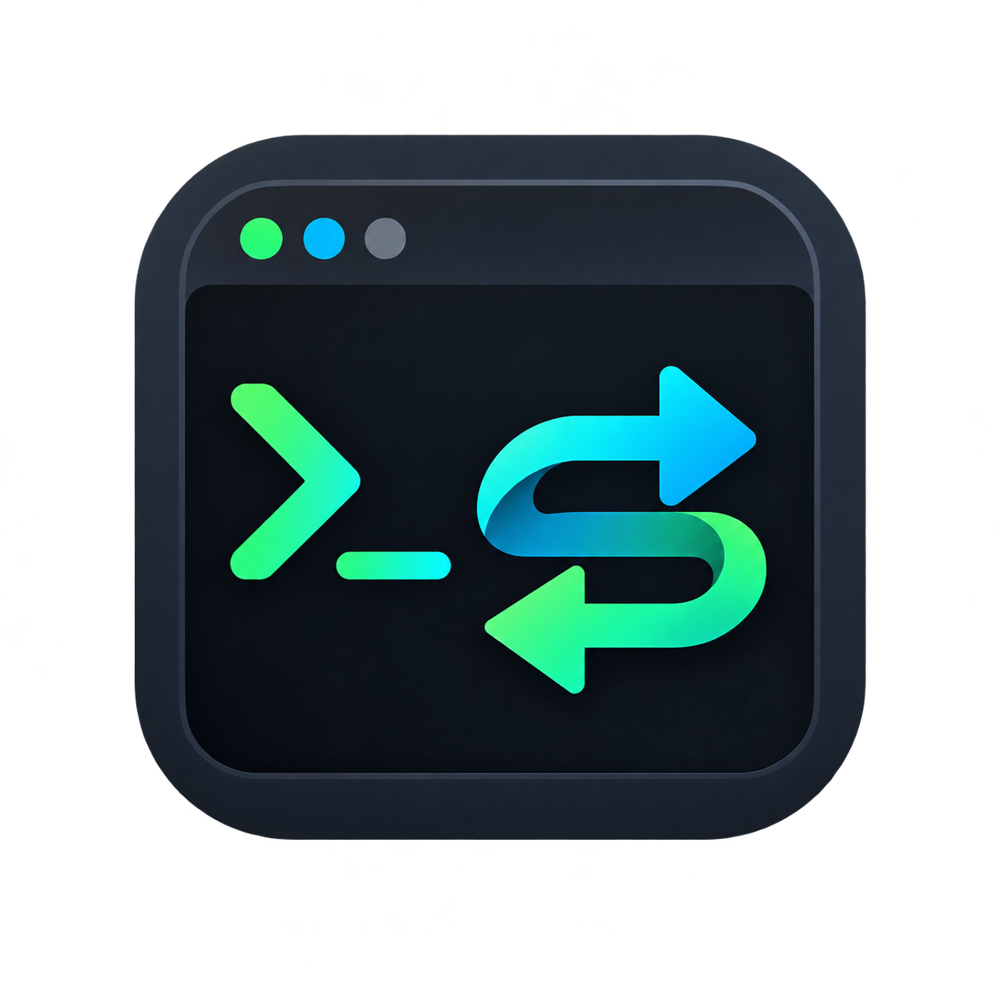
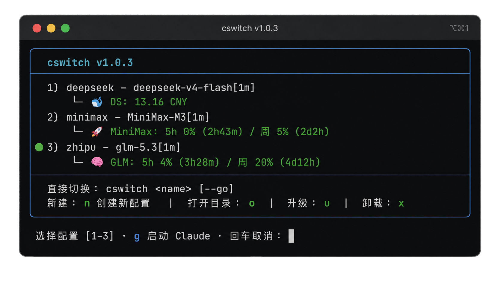

<p align="center" style="margin-bottom:0">
  
</p>

<h1 align="center" style="color:#3faec2;font-weight:bold;margin-top:0">cswitch</h1>

<p align="center">
  
  
  
  
</p>

cswitch 是一个命令行脚本，一键切换 Claude Code 模型配置（DeepSeek / 智谱 / MiniMax 等），支持交互菜单、用量查询、配置向导、Claude Code 安装与日常更新，以及脚本自更新。

适用于 **Linux**、**macOS** 和 **WSL2**（Windows Subsystem for Linux 2），要求 `bash 3.2+`（macOS 自带）、`python3`、`curl`。

## 安装

```bash
curl -fsSL https://raw.githubusercontent.com/zeno528/cswitch/main/install.sh | bash
```

若 `~/.local/bin` 不在 PATH，安装器会提示你加入：

```bash
echo 'export PATH="$HOME/.local/bin:$PATH"' >> ~/.bashrc && source ~/.bashrc
```

macOS 默认 shell 是 zsh 的话，改用：

```bash
echo 'export PATH="$HOME/.local/bin:$PATH"' >> ~/.zshrc && source ~/.zshrc
```

<p align="center">
  
</p>

## 用法

| 命令 | 说明 |
| --- | --- |
| `cswitch` | 交互菜单（查看/切换/用量/新建） |
| `cswitch <name> [--go]` | 切换到 profile，`--go` 切换后启动 Claude |
| `cswitch new` | 新建配置向导 |
| `cswitch version` | 显示版本 |
| `cswitch check-update` | 检查更新 |
| `cswitch update` | 升级到最新版 |
| `cswitch claude` | 安装/更新 Claude Code（`--info` 查看状态，`-f` 强制升级） |
| `cswitch uninstall` | 卸载 |

profile 存放在 `~/.claude/model-profiles/`，切换时把 profile 的 `env` 合并进 `~/.claude/settings.json`（带备份回滚），并记录当前配置到 `~/.claude/.current-model-profile`。

## 更新机制

本地 `VERSION` 文件与 GitHub 远端 `VERSION` 比对，Python 逐段比较版本号；有新版时下载 GitHub codeload tarball，备份旧安装目录后替换，不需要目标机器装 git。

## 目录结构

```
cswitch/
├── cswitch        # 主入口（参数分发）
├── install.sh           # 一行安装器
├── VERSION              # 版本文件
├── lib/
│   ├── common.sh        # 路径、颜色、宽度/框打印、版本
│   ├── profile.sh       # profile 读取、新建向导
│   ├── switch.sh        # 核心切换逻辑
│   ├── usage.sh         # 三家用量查询
│   ├── menu.sh          # 交互菜单
│   └── selfupdate.sh    # 检查更新 / 升级 / 卸载
└── README.md
```

## 从源码运行

```bash
git clone https://github.com/zeno528/cswitch.git
cd cswitch
./cswitch
```

源码运行同样支持全部子命令，只是 `update` 需要安装目录结构（正常安装后使用）。

## License

[MIT](LICENSE)
